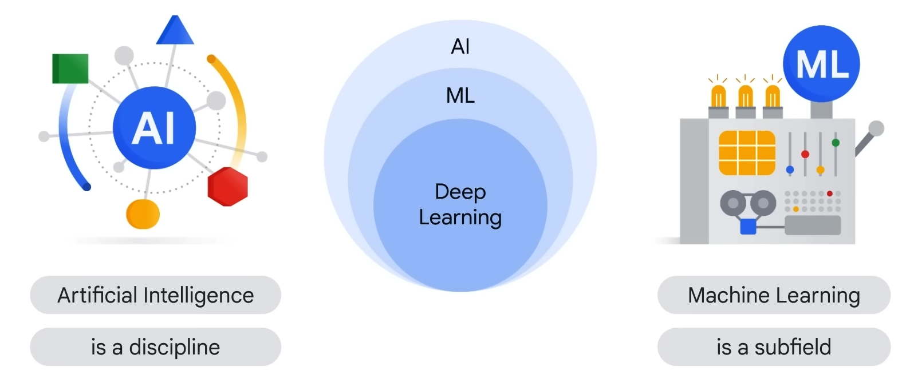
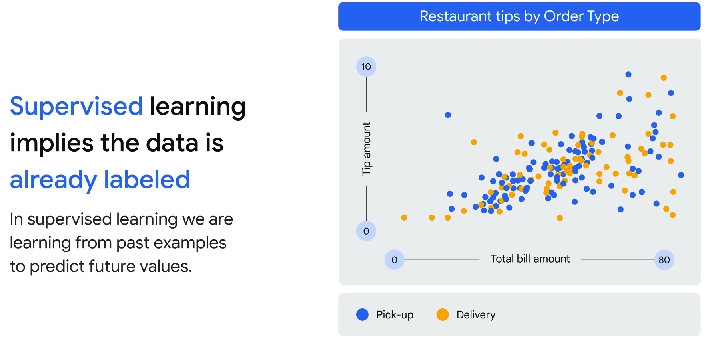
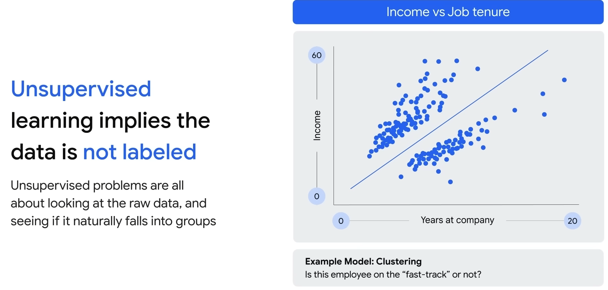
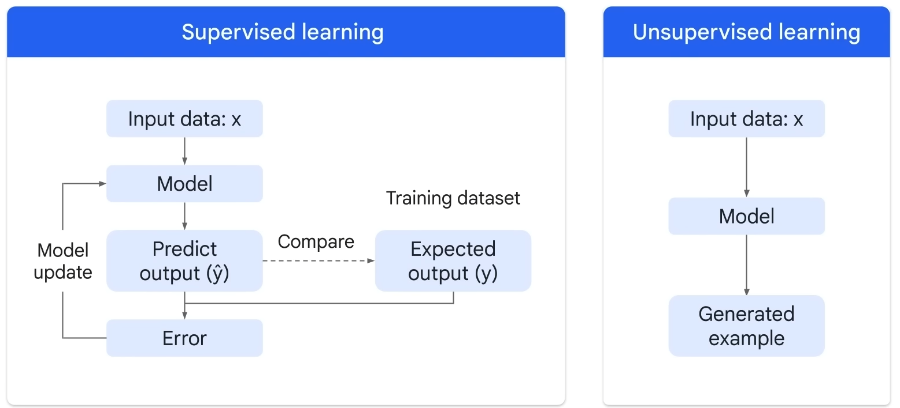
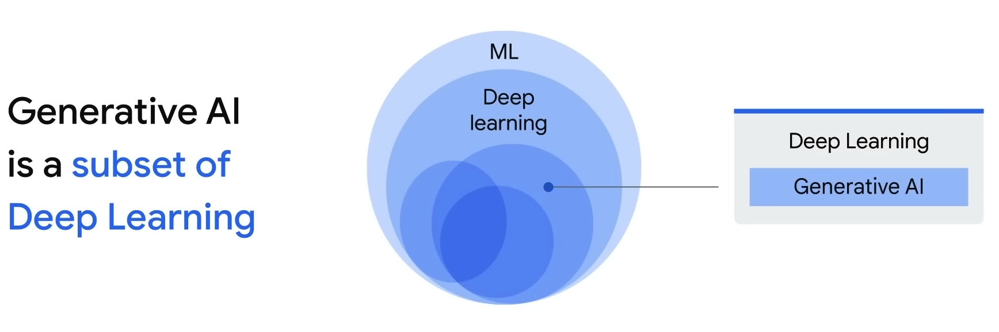
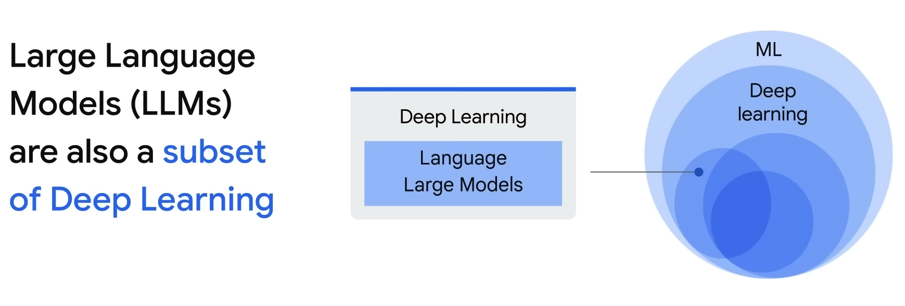
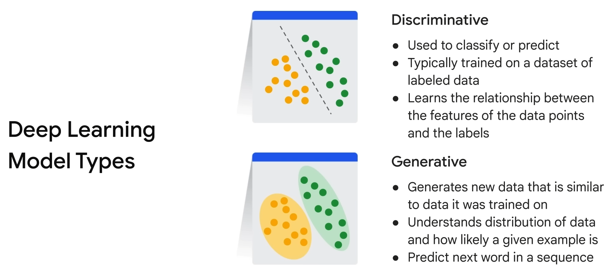
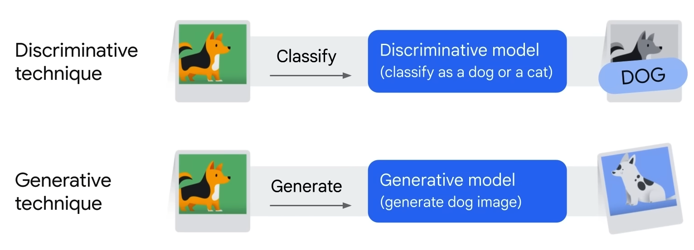
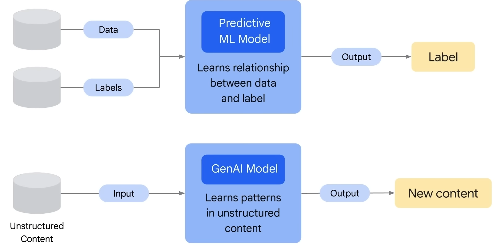
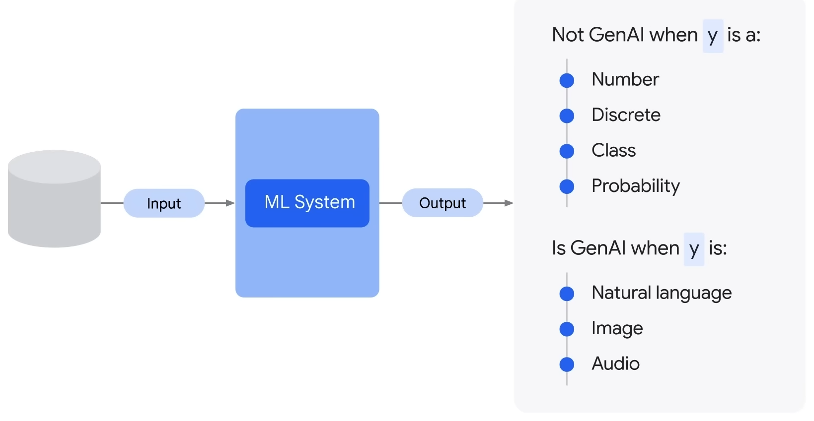

# Introduction to Generative AI
## Introduction to Generative AI

### Introduction to Generative AI
In this comprehensive course, participants will delve into the multifaceted realm of generative AI. The curriculum covers the definition of generative AI, elucidates how it functions, describes various generative AI model types, and explores its wide-ranging applications.

Generative AI stands as a pinnacle within artificial intelligence technology, capable of producing diverse content across mediums such as text, imagery, audio, and synthetic data.

### Artificial Intelligence
Before immersing ourselves in the intricacies of generative artificial intelligence, it is crucial to establish a foundational understanding of artificial intelligence. Frequently, inquiries arise regarding the nature of artificial intelligence and the distinctions between AI and machine learning.

*Figure 1: AI and Machine Learning (source - <a href = "https://www.cloudskillsboost.google/course_templates/536" target="_blank">https://www.cloudskillsboost.google/course_templates/536</a>)*

Artificial Intelligence (AI) can be likened to a discipline, akin to physics, within the vast landscape of computer science. It deals with the creation of intelligent agents—systems that possess the ability to reason, learn, and act autonomously. In essence, AI revolves around the theoretical frameworks and methodologies for constructing machines capable of thinking and behaving like humans.

## Types of Machine Learning Models

This brings us to the specialized field of **machine learning**, a subset of AI. Machine learning involves programs or systems that train models based on input data. These trained models can then make meaningful predictions when presented with new, previously unseen data from the same dataset used for training.

Two primary classes of machine learning models are:

- **Supervised Machine Learning:** Models are trained on labeled data, which includes tags such as names, types, or numbers.

- **Unsupervised Machine Learning:** In contrast, unsupervised models are trained on unlabeled data, devoid of predefined tags.

*Figure 2: Supervised Learning (source - <a href = "https://www.cloudskillsboost.google/course_templates/536" target="_blank">https://www.cloudskillsboost.google/course_templates/536</a>)*

Consider a scenario where a restaurant owner, armed with historical data on bill amounts and tips based on order types and delivery methods, employs supervised learning. The model, learning from past examples, predicts future values, such as tips, based on total bill amounts and delivery specifics.

## Unsupervised Learning

*Figure 3: Unsupervised Learning (source - <a href = "https://www.cloudskillsboost.google/course_templates/536" target="_blank">https://www.cloudskillsboost.google/course_templates/536</a>)*

Unsupervised learning tackles problems like clustering employees based on tenure and income to discern patterns within raw data. This approach is all about discovery, exploring data to identify natural groupings without predefined labels.

## Learning Process

*Figure 4: Learning Process (source - <a href = "https://www.cloudskillsboost.google/course_templates/536" target="_blank">https://www.cloudskillsboost.google/course_templates/536</a>)*

To deepen our understanding, let's delve graphically into the learning process. In supervised learning, testing data values (x) are input into the model. The model produces a prediction, compared to the training data. If the predicted and actual values differ significantly, it's termed as error. The model minimizes this error, refining predictions until they align closely with actual values—a classic optimization problem.

## Generative AI

*Figure 5: Generative AI (source - <a href = "https://www.cloudskillsboost.google/course_templates/536" target="_blank">https://www.cloudskillsboost.google/course_templates/536</a>)*

Now, let's progress to the focal point of this exploration—Generative AI. Operating as a subset of deep learning, Generative AI utilizes artificial neural networks capable of processing both labeled and unlabeled data through supervised, unsupervised, and semi-supervised methods.

## Large Language Model

*Figure 6: Large Language Model (source - <a href = "https://www.cloudskillsboost.google/course_templates/536" target="_blank">https://www.cloudskillsboost.google/course_templates/536</a>)*

Within the realm of Generative AI, large language models play a pivotal role. These models, another subset of deep learning, contribute significantly to the capabilities and applications of generative AI.

## Types of Deep Learning Models

Deep learning models, encompassing generative AI and beyond, can be broadly categorized into two types:

- **Generative Models**
- **Discriminative Models**

*Figure 7: Types of Deep Learning Models (source - <a href = "https://www.cloudskillsboost.google/course_templates/536" target="_blank">https://www.cloudskillsboost.google/course_templates/536</a>)*

These models form the cornerstone of advanced AI applications, each serving distinct purposes and contributing to the broader landscape of artificial intelligence.

## Discriminative Model

A discriminative model is a classification or prediction model used to assign labels to data points. Typically trained on a labeled dataset, discriminative models learn the relationship between the features of data points and their corresponding labels. Once trained, a discriminative model can predict labels for new, unseen data points.

## Generative Model

In contrast, a generative model generates new data instances based on a learned probability distribution derived from existing data. Generative models have the capability to create entirely new content.

*Figure 1: Differences Between Discriminative and Generative Models (source - <a href = "https://www.cloudskillsboost.google/course_templates/536" target="_blank">https://www.cloudskillsboost.google/course_templates/536</a>)*

Consider the illustration above. In a discriminative model, the focus is on learning the conditional probability distribution or the probability of output (y) given input (x), enabling it to classify the input as a specific category, such as identifying a dog rather than a cat. On the other hand, a generative model learns the joint probability distribution, representing the probability of both input (x) and output (y). It can then predict the conditional probability that an input is associated with a particular output, allowing it to generate entirely new instances, such as creating a picture of a dog.

**So to summarize, generative models can generate new data instances while discriminative models discriminate between different kinds of data instances.**

*Figure 1: Generative vs Discriminative Models (source - <a href = "https://www.cloudskillsboost.google/course_templates/536" target="_blank">https://www.cloudskillsboost.google/course_templates/536</a>)*

The top image shows a traditional machine learning model that attempts to learn the relationship between the data and the label. The bottom image shows a generative AI model that attempts to learn patterns in content so that it can generate new content.

*Figure 2: Generative AI vs Not Generative AI (source - <a href = "https://www.cloudskillsboost.google/course_templates/536" target="_blank">https://www.cloudskillsboost.google/course_templates/536</a>)*

A good way to distinguish what is gen AI and what is not is shown in this illustration. It is not gen AI when the output (y or label) is a number or a class (e.g., spam or not spam). It is gen AI when the output is natural language, like speech or text, an image, or audio.

To illustrate mathematically, if the output (y) is a number (e.g., predicted sales), it is not gen AI. If y is a sentence (e.g., define sales), it is generative as the question would elicit a text response based on the massive data the model was trained on.

At a high level, traditional supervised and unsupervised learning involves training a model on labeled data to make predictions or classifications. In contrast, generative AI can take both labeled and unlabeled data of various types to build a foundation model. This model can then generate new content such as text, code, images, audio, and video.

We've transitioned from traditional programming to neural networks and now to generative models. Generative AI allows users to generate their own content by leveraging large language models like PaLM or Pathways Language Model and LaMDA or Language Model for Dialogue Applications. These models learn from vast data sources across the internet, enabling users to obtain information by simply asking questions.

Now, let's provide a formal definition of generative AI. Generative AI is a type of artificial intelligence that creates new content based on what it has learned from existing content. The process of learning from existing content is called training, resulting in the creation of a statistical model. When given a prompt, AI uses the model to predict an expected response, generating new content. Essentially, it learns the underlying structure of the data and can generate new samples similar to the data it was trained on.

Large language models are one type of generative AI, generating novel combinations of text in natural-sounding language. These models learn patterns and language through training data and predict what comes next based on given text.

Generative AI applications include text-to-text models for translation, text-to-image models for image generation, text-to-video and text-to-3D models for multimedia content creation, and text-to-task models for performing defined tasks based on text input.

A foundation model is a large AI model pre-trained on extensive data, adaptable to a wide range of downstream tasks. These models have the potential to revolutionize various industries, including healthcare, finance, and customer service.

Vertex AI offers a model garden that includes foundation models, such as PaLM API for chat and text and stable diffusion for image generation.

Generative AI Studio and Generative AI App Builder provide tools for developers to explore, customize, and create generative AI models without extensive coding. PaLM API allows testing and experimentation with large language models and generative AI tools.

Thank you for watching our course, Introduction to Generative AI.

