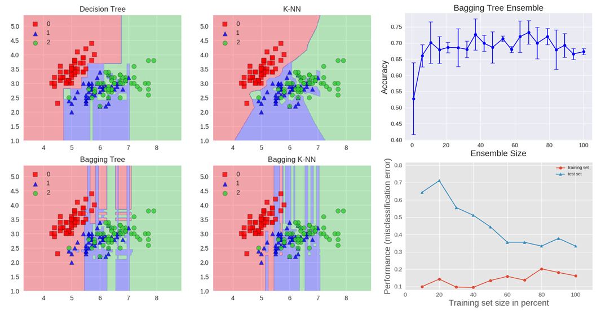
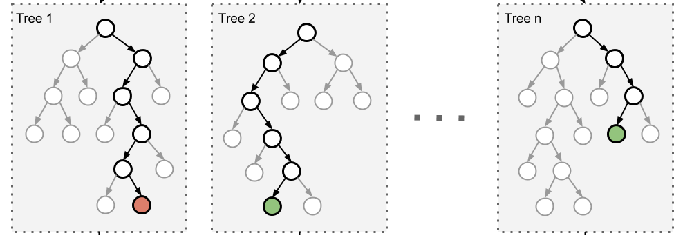
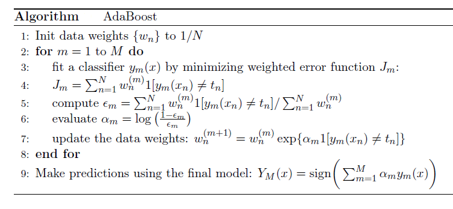
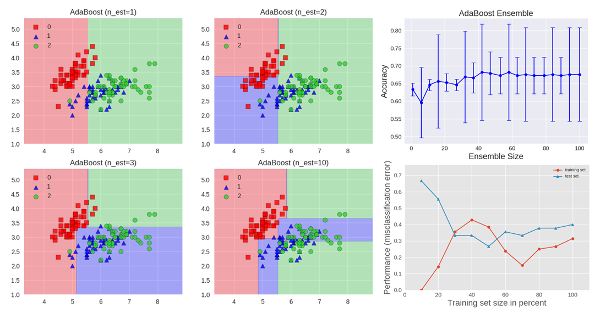
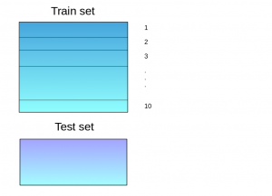
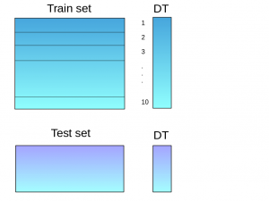
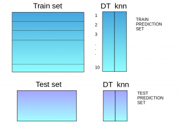
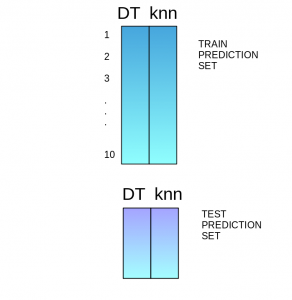

# Ensemble Learning

## Introduction

Imagine buying a new car. Would you simply rely on the advice of a single dealer at the first car shop you visit? Unlikely.

Instead, you'd likely explore various web portals, read reviews, compare different models, and seek opinions from friends and colleagues. In essence, your decision-making process involves considering multiple sources of information before reaching a conclusion.

Ensemble models in machine learning embrace a similar principle. They amalgamate decisions from multiple models to enhance overall performance. This can be accomplished through various methods, all of which you'll explore in this article.

To grasp the concept of ensemble learning, let's consider an analogy. Imagine you're a movie director who has just created a short film on a captivating topic. Before releasing it to the public, you wish to gather preliminary feedback in the form of ratings. How might you go about this?

- **Option A: Asking a Friend**
  - While you could ask a close friend for their rating, there's a risk that their love for you might bias their rating, and they may hesitate to give an honest critique.

- **Option B: Consulting Colleagues**
  - Seeking ratings from five colleagues might provide a more diverse perspective. However, they may not be subject matter experts on the specific topic of your film.

- **Option C: Surveying 50 People**
  - By expanding the pool to 50 individuals, including friends, colleagues, and strangers, you create a more varied and generalized response. This diverse group with different skill sets is likely to offer more honest and comprehensive ratings.

In the realm of machine learning, this principle of leveraging diversity to enhance decision-making is encapsulated in ensemble learning. Similar to the movie director seeking a range of opinions, ensemble learning combines predictions from multiple models to improve overall performance.

In summary, a diverse ensemble of models often makes better decisions than individual models. Now that we've introduced the concept of ensemble learning, let's explore various techniques and their implementations.

## Simple Ensemble Techniques

In this section, we'll explore a set of simple yet powerful ensemble techniques, including:

1. **Max Voting**
2. **Averaging**
3. **Weighted Averaging**

These straightforward methods lay the foundation for more advanced ensemble techniques and can significantly enhance the robustness and accuracy of machine learning models. Let's delve into each of these techniques to understand how they contribute to ensemble learning.

### Max Voting

The max voting method is primarily employed for classification problems. In this technique, multiple models contribute predictions for each data point. These predictions, akin to 'votes,' are then aggregated, and the prediction that receives the majority of votes is considered the final prediction.

To illustrate, let's revisit the movie rating analogy. Assume you asked five colleagues to rate your movie (on a scale of 5), and their responses are as follows:

| Colleague 1 | Colleague 2 | Colleague 3 | Colleague 4 | Colleague 5 | Final Rating |
|-------------|-------------|-------------|-------------|-------------|--------------|
| 5           | 4           | 5           | 4           | 4           | 4            |

In this example, the majority rating is 4, as three colleagues gave it a 4. Consequently, the final rating using the max voting method is 4. This approach essentially involves determining the mode of all predictions to arrive at the final decision.

### Averaging

Similar to the max voting technique, averaging involves making multiple predictions for each data point. In this method, the predictions from all models are averaged, and the resulting average is used as the final prediction. Averaging is commonly used for making predictions in regression problems or when calculating probabilities for classification problems.

For instance, consider the following ratings from five colleagues:

| Colleague 1 | Colleague 2 | Colleague 3 | Colleague 4 | Colleague 5 | Final Rating |
|-------------|-------------|-------------|-------------|-------------|--------------|
| 5           | 4           | 5           | 4           | 4           | 4.4          |

In this example, the averaging method calculates the average of all values:
$$ \text{Final Rating} = \frac{5 + 4 + 5 + 4 + 4}{5} = 4.4 $$

Therefore, the final rating using the averaging method is 4.4.

### Weighted Average

The weighted average is an extension of the averaging method, where each model is assigned a specific weight, indicating its importance in the prediction process. This approach allows for giving more weight to certain models over others, based on their expertise or credibility.

For example, consider the following weights assigned to colleagues based on their expertise:

|            | Colleague 1 | Colleague 2 | Colleague 3 | Colleague 4 | Colleague 5 |              |
|------------|-------------|-------------|-------------|-------------|-------------|--------------|
| Weight     | 0.23        | 0.23        | 0.18        | 0.18        | 0.18        |              |
| Rating     | 5           | 4           | 5           | 4           | 4           | 4.41         |

The result is calculated as:
$$ \text{Final Rating} = (5 \times 0.23) + (4 \times 0.23) + (5 \times 0.18) + (4 \times 0.18) + (4 \times 0.18) = 4.41 $$

In this example, the weighted average method yields a final rating of 4.41, considering the assigned weights for each colleague's rating.

## Advanced Ensemble Techniques

Now that we've covered the basic ensemble techniques, let's delve into the understanding of advanced techniques.

Ensemble learning enhances machine learning results by combining multiple models, resulting in improved predictive performance compared to a single model. Ensemble methods have demonstrated their effectiveness in various machine learning competitions, including prestigious events like the Netflix Competition, KDD 2009, and Kaggle.

Ensemble methods, often referred to as meta-algorithms, amalgamate diverse machine learning techniques into a single predictive model. They aim to address different aspects such as decreasing variance (bagging), reducing bias (boosting), or enhancing overall predictions (stacking).

Advanced ensemble methods can be broadly categorized into two groups:

- **Sequential Ensemble Methods:**
  - Base learners are generated sequentially (e.g., AdaBoost).
  - Sequential methods aim to exploit the dependence between base learners. The performance is boosted by assigning higher weight to previously mislabeled examples.

- **Parallel Ensemble Methods:**
  - Base learners are generated in parallel (e.g., Random Forest).
  - Parallel methods focus on exploiting independence between base learners, reducing errors significantly through averaging.

Ensemble methods often employ a single base learning algorithm, producing homogeneous base learners (learners of the same type), resulting in homogeneous ensembles. However, there are also methods that leverage heterogeneous learners (learners of different types), leading to heterogeneous ensembles. For ensemble methods to outperform individual members, base learners need to be as accurate and diverse as possible.

### Bagging

Bagging, short for bootstrap aggregation, is a technique aimed at reducing the variance of an estimate by averaging together multiple estimates. The process involves training multiple base learners on different subsets of the data, randomly chosen with replacement. The ensemble is then formed by aggregating the outputs of these base learners.

For an ensemble with M base learners, the aggregated prediction $f(x)$ is calculated as follows:
$$ f(x) = \frac{1}{M} \sum_{m=1}^M f_m(x) $$

Bagging commonly utilizes bootstrap sampling to generate the data subsets for training the base learners. The aggregation method involves voting for classification problems and averaging for regression problems.

Let's explore bagging in the context of a classification task on the Iris dataset. Two base estimators, a decision tree and a $k$-NN classifier, are chosen. The figure below illustrates the learned decision boundary of the base estimators as well as their bagging ensembles applied to the Iris dataset.

- Accuracy: 0.63 (+/- 0.02) [Decision Tree]
- Accuracy: 0.70 (+/- 0.02) [K-NN]
- Accuracy: 0.64 (+/- 0.01) [Bagging Tree]
- Accuracy: 0.59 (+/- 0.07) [Bagging K-NN]

The decision tree exhibits axis-parallel boundaries, while the $k=1$ nearest neighbors closely fit the data points. The bagging ensembles were trained with 10 base estimators, utilizing 0.8 subsampling of training data and 0.8 subsampling of features.

The decision tree bagging ensemble achieves higher accuracy compared to the $k$-NN bagging ensemble. $k$-NN, known as stable learners, are less sensitive to perturbations in training samples, making them less advantageous for ensemble learning since combining stable learners may not significantly improve generalization performance.

The figure also illustrates how test accuracy improves with the size of the ensemble. Cross-validation results indicate that accuracy increases until around 10 base estimators and then plateaus (reaches a state of little or no change following a period of activity or progress). Thus, adding base estimators beyond 10 only increases computational complexity without yielding accuracy gains for the Iris dataset.

The learning curves for the bagging tree ensemble reveal an average error of 0.3 on the training data and a U-shaped error curve for the testing data. The smallest gap between training and test errors occurs at approximately 80\% of the training set size.

A widely used class of ensemble algorithms is forests of randomized trees.

In **random forests**, each tree in the ensemble is constructed from a sample drawn with replacement (a bootstrap sample) from the training set. Additionally, instead of using all features for splitting nodes, a random subset of features is selected, further introducing randomness to the tree.

While this randomization process slightly increases the bias of the forest, the ensemble benefits from the averaging of less correlated trees, leading to a reduction in variance and resulting in an overall improved model.

In an **extremely randomized trees** algorithm, randomness is taken a step further. Not only are samples and features randomized, but the splitting thresholds are also randomized. Instead of searching for the most discriminative threshold, thresholds are randomly drawn for each candidate feature, and the best of these randomly-generated thresholds is chosen as the splitting rule. This additional level of randomness often allows for a further reduction in the variance of the model, albeit with a slightly greater increase in bias.

### Boosting

Boosting refers to a family of algorithms that can transform weak learners into strong learners. The fundamental principle behind boosting is to fit a sequence of weak learners — models that are only slightly better than random guessing, such as small decision trees — to weighted versions of the data. More weight is assigned to examples that were misclassified by earlier rounds.

The predictions from these weak learners are then combined through a weighted majority vote (for classification) or a weighted sum (for regression) to produce the final prediction. The key distinction between boosting and committee methods like bagging is that base learners in boosting are trained sequentially on a weighted version of the data.

### AdaBoost Algorithm

The algorithm presented below outlines the most widely used form of boosting, known as AdaBoost (Adaptive Boosting).

In AdaBoost, the first base classifier, denoted as $y_1(x)$, is trained with equal weighting coefficients. Subsequent boosting rounds adjust the weighting coefficients, increasing them for misclassified data points and decreasing them for correctly classified ones.

The variable epsilon represents the weighted error rate of each base classifier. The weighting coefficients alpha assign greater weight to more accurate classifiers.

The figure above illustrates the AdaBoost algorithm. Each base learner comprises a decision tree with depth 1, classifying the data based on a feature threshold that partitions the space into two regions separated by a linear decision surface parallel to one of the axes. The figure also depicts how the test accuracy improves with the size of the ensemble, along with learning curves for training and testing data.

### Gradient Tree Boosting

**Gradient Tree Boosting** represents a generalization of boosting that extends to arbitrary differentiable loss functions, making it applicable to both regression and classification problems. This technique builds the model in a sequential manner.

$$ F_m(x) = F_{m-1}(x) + \gamma_mh_m(x) $$

At each stage, the decision tree $ h_m(x) $ is chosen to minimize a loss function $ L $ given the current model $ F_{m-1}(x) $:

$$ F_m(x) = F_{m-1}(x) + \text{argmin}_h \sum_{i=1}^n L(y_i, F_{m-1}(x_i) + h(x_i)) $$

The algorithms for regression and classification differ based on the type of loss function used. Gradient Tree Boosting builds a strong predictive model by sequentially adding weak learners, adapting each new learner to the errors made by the existing model. This adaptability makes it a powerful and versatile technique for various machine learning tasks.

### Stacking

**Stacking** is an ensemble learning technique that leverages predictions from multiple models (e.g., decision tree, k-NN, SVM) to construct a new model. This new model is then used for making predictions on the test set. Below is a step-wise explanation of a simple stacked ensemble:

1. The train set is divided into 10 parts.
   

2. A base model, such as a decision tree, is trained on 9 parts of the train set, and predictions are made for the 10th part. This process is repeated for each part of the train set.

### Stacking (Continued)

3. The base model (in this case, a decision tree) is then trained on the entire train dataset.

4. Using this model, predictions are made on the test set.
   

5. Steps 2 to 4 are repeated for another base model (e.g., k-NN), resulting in another set of predictions for the train set and test set.
   

6. The predictions from the train set are used as features to build a new model.
   

7. This model is used to make final predictions on the test set.

Stacking is an ensemble learning technique that combines multiple classification or regression models through a meta-classifier or a meta-regressor. The base-level models are trained on the complete training set, and then the meta-model is trained on the outputs of the base-level models as features.

The base level often consists of different learning algorithms, making stacking ensembles heterogeneous. The algorithm below summarizes the stacking process.

### Stacking Ensemble Visualization

The figures above illustrate the stacking ensemble and its performance:

- **Top Left:** The decision boundaries of individual classifiers (k-NN, Random Forest, Naive Bayes) are shown.

- **Top Right:** The blending of decision boundaries achieved by the Stacking Classifier is depicted. The accuracy of each individual classifier and the stacking ensemble is presented.

- **Bottom:** Learning curves indicate the performance of each classifier and the stacking ensemble. Stacking achieves higher accuracy than individual classifiers, and there are no signs of overfitting.

The stacking ensemble consists of k-NN, Random Forest, and Naive Bayes base classifiers, with Logistic Regression serving as the meta-classifier. The figure demonstrates the effective combination of decision boundaries achieved by the stacking classifier. Additionally, the figure highlights that stacking attains higher accuracy compared to individual classifiers. Based on learning curves, there are no indications of overfitting.

Stacking is a widely employed technique for achieving success in Kaggle data science competitions. For instance, the first-place solution for the Otto Group Product Classification challenge utilized a stacking ensemble comprising over 30 models. The outputs of these models were used as features for three meta-classifiers: XGBoost, Neural Network, and Adaboost. Further details can be found in [this link](#).

### Blending Ensemble Technique

Blending is an ensemble learning technique that shares similarities with stacking but with a slight difference in its approach. In blending, predictions are exclusively made on a holdout (validation) set from the training data. The predictions on the holdout set, along with the holdout set itself, are then utilized to build a model that is subsequently applied to the test set. Here's a step-by-step explanation of the blending process:

1. **Data Splitting:**
   - The train set is divided into training and validation sets.
   

2. **Model Training:**
   - Model(s) are trained on the training set.

3. **Prediction:**
   - Predictions are made on both the validation set and the test set.
   

4. **Building a New Model:**
   - The validation set and its predictions are used as features to construct a new model.

5. **Final Predictions:**
   - The newly created model is applied to make final predictions on both the test set and meta-features.

Blending, like stacking, leverages the combination of predictions from various models to enhance overall performance. However, in blending, the focus is on utilizing a holdout set for prediction and subsequent model construction, offering an alternative approach to stacking.