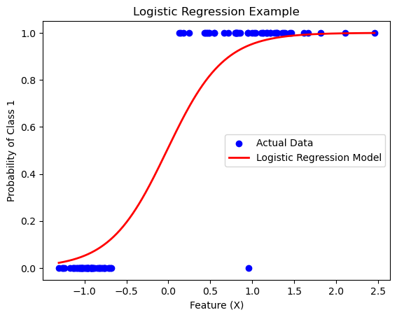

# Logistic Regression
## Logistic Regression

## Logistic Regression: Unraveling Classification with Precision

### Overview

**Logistic Regression** is a powerful statistical method commonly used for binary classification tasks. Despite the term "regression," it's a classification algorithm ideal for predicting outcomes with two classes, often denoted as 0 and 1.

### The Equation

The logistic regression model transforms a linear combination of input features using the sigmoid function, creating a probability score. The equation takes the form:

$$ P(Y=1) = \frac{1}{1 + e^{-(b_0 + b_1X_1 + b_2X_2 + \ldots + b_nX_n)}} $$

- $ P(Y=1) $: Probability of the dependent variable $ Y $ being 1.
- $ e $: Base of the natural logarithm.
- $ b_0, b_1, b_2, \ldots, b_n $: Coefficients.
- $ X_1, X_2, \ldots, X_n $: Independent variables.

### Working Principles

Logistic Regression is a statistical method used for binary classification, predicting the probability of an instance belonging to a particular class. Its working principle involves several key components:

1. **Sigmoid (Logistic) Function**
   - Logistic Regression uses the sigmoid function (also known as the logistic function) to transform a linear combination of input features into a probability score between 0 and 1. The sigmoid function is defined as:
     $$ \sigma(z) = \frac{1}{1 + e^{-z}} $$
   - Here, $z$ is the linear combination of input features and coefficients.

2. **Linear Combination**
   - Logistic Regression assumes a linear relationship between the input features and the log-odds of the probability of the positive class. The linear combination is expressed as:
     $$ z = b_0 + b_1x_1 + b_2x_2 + \ldots + b_nx_n $$
   - $b_0, b_1, b_2, \ldots, b_n$ are the coefficients, and $x_1, x_2, \ldots, x_n$ are the input features.

3. **Log-Odds Transformation**
   - The linear combination $z$ is then transformed into log-odds using the sigmoid function:
     $$\text{log-odds} = \log\left(\frac{P(Y=1)}{1 - P(Y=1)}\right) = z $$

4. **Probability Prediction**
   - The log-odds are then converted into probabilities using the inverse of the sigmoid function. The probability $P(Y=1)$ represents the likelihood of the instance belonging to the positive class.

5. **Decision Boundary**
   - Logistic Regression determines a decision boundary based on the learned coefficients. If the predicted probability is greater than a certain threshold (typically 0.5), the instance is classified as the positive class; otherwise, it is classified as the negative class.

6. **Training**
   - The model is trained using a process called Maximum Likelihood Estimation (MLE) or optimization algorithms (e.g., gradient descent). The goal is to adjust the coefficients to maximize the likelihood of the observed data given the model.

7. **Cost Function**
   - The optimization process involves minimizing a cost function, often the cross-entropy loss, which penalizes the model for incorrect predictions.

In summary, Logistic Regression models the probability of an instance belonging to a particular class using a linear combination of input features transformed by the sigmoid function. The model is trained to adjust its coefficients to make accurate predictions and is widely used for binary classification tasks.

### Examples:

**1. Email Spam Classification**
   - *Problem:* Predict whether an email is spam (1) or not (0).
   - *Application:* Filtering out unwanted emails based on their content.

**2. Loan Approval**
   - *Problem:* Approve (1) or deny (0) a loan application.
   - *Application:* Assessing creditworthiness using factors like income and credit score.

### Python Code Example:

Let's dive into a Python example using `scikit-learn` to illustrate logistic regression with synthetic data:

```python
# Import necessary libraries
import numpy as np
import matplotlib.pyplot as plt
from sklearn.linear_model import LogisticRegression
from sklearn.datasets import make_classification
from sklearn.model_selection import train_test_split
from sklearn.metrics import accuracy_score

# Generate synthetic data
X, y = make_classification(n_samples=100, n_features=1, n_informative=1, n_redundant=0, n_clusters_per_class=1, random_state=42)

# Split the data into training and testing sets
X_train, X_test, y_train, y_test = train_test_split(X, y, test_size=0.25, random_state=42)

# Create a Logistic Regression model
model = LogisticRegression()

# Train the model
model.fit(X_train, y_train)

# Make predictions
y_pred = model.predict(X_test)

# Calculate accuracy
accuracy = accuracy_score(y_test, y_pred)
print(f"Accuracy: {accuracy*100:.2f}%")

# Plotting the decision boundary
X_range = np.linspace(X.min(), X.max(), 300)
y_prob = model.predict_proba(X_range.reshape(-1, 1))[:, 1]

plt.scatter(X, y, color='blue', label='Actual Data')
plt.plot(X_range, y_prob, color='red', linewidth=2, label='Logistic Regression Model')
plt.xlabel('Feature (X)')
plt.ylabel('Probability of Class 1')
plt.title('Logistic Regression Example')
plt.legend()
plt.show()
```


### Output


### Breakdown

1. **Data Generation:** Create synthetic data for a clear illustration.
2. **Model Training:** Fit a Logistic Regression model to the training data.
3. **Prediction and Accuracy:** Evaluate the model's accuracy on the testing set.
4. **Decision Boundary Plot:** Visualize the logistic regression model's decision boundary.

This example serves as a stepping stone for those exploring the world of classification algorithms. Feel free to adapt this code to your specific use cases and datasets. The versatility of logistic regression makes it a valuable tool in your machine learning journey. Happy coding!