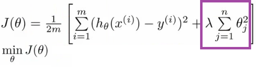
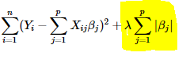
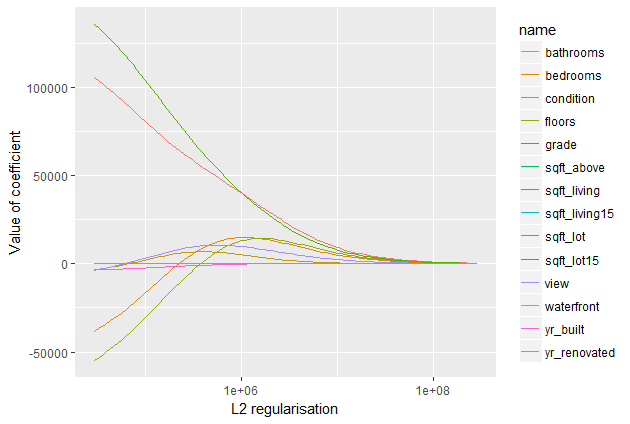
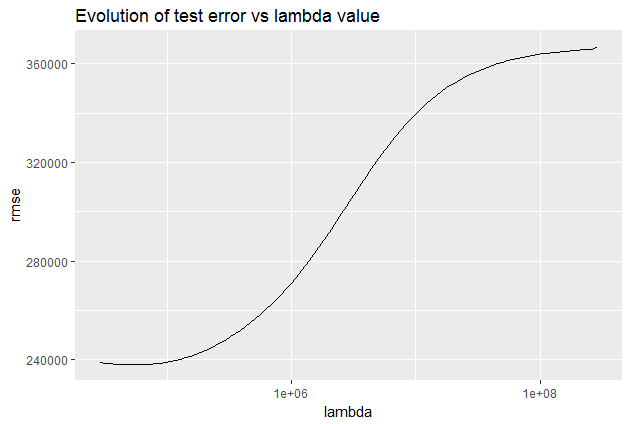
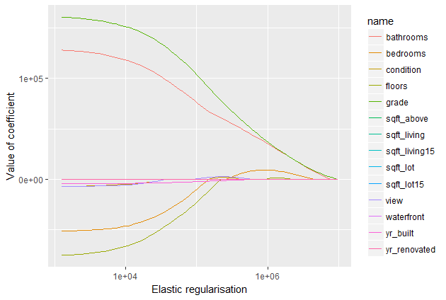
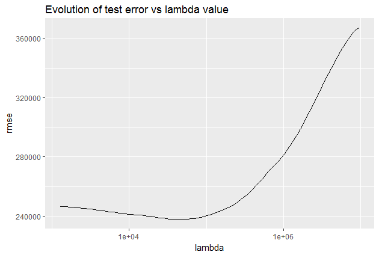
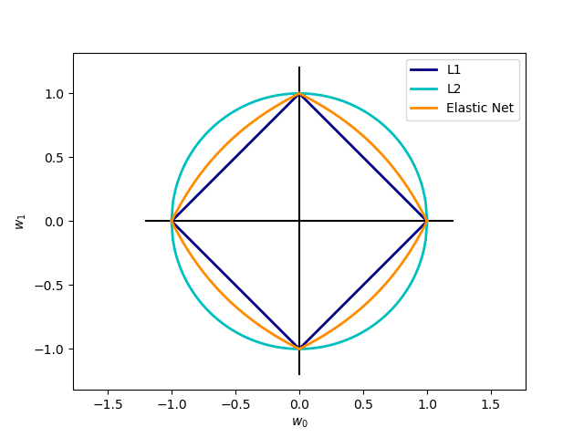

## Introduction

In supervised machine learning, models undergo training on a subset of data, commonly referred to as training data. The primary objective is to compute the target value for each training example within this dataset.

However, a challenge known as overfitting arises during this training process. Overfitting occurs when a model not only learns the underlying patterns (signal) in the training data but also captures the noise present. Consequently, such a model may not perform well on new, unseen data on which it was not trained.

To mitigate the risk of overfitting, several strategies can be employed:

1. **Cross-Validation Sampling:**
   Implementing techniques like cross-validation involves partitioning the dataset into subsets for training and validation. This helps evaluate the model's performance on different data partitions, ensuring a more robust generalization.

2. **Feature Reduction:**
   Overfitting can be mitigated by reducing the number of features used in the model. This involves carefully selecting or eliminating certain features to focus on the most relevant ones.

3. **Pruning:**
   Pruning refers to the process of refining a model, often applied to decision trees. It involves removing unnecessary branches and nodes that might capture noise in the training data, thereby enhancing the model's ability to generalize.

4. **Regularization:**
   Regularization techniques introduce penalties for complex models by adding a regularization term to the cost function during training. This discourages the model from fitting the noise in the data too closely.

By employing these methods, practitioners can strike a balance between capturing meaningful patterns in the training data and ensuring the model's ability to generalize effectively to new, unseen data. This approach is pivotal for developing robust and reliable machine learning models.

## Impact on Model Complexity

Regularization serves as a crucial technique in machine learning by introducing a penalty as the model's complexity increases. The regularization parameter, often denoted as lambda (λ), imposes penalties on all parameters except the intercept. This strategic penalty application aims to foster model generalization, preventing overfitting to the training data.

$$\begin{array}{l}J(\theta)=\frac{1}{2 m}\left[\sum_{i=1}^m\left(h_\theta\left(x^{(i)}\right)-y^{(i)}\right)^2+\lambda \sum_{j=1}^n \theta_j^2\right] \\ \min _\theta J(\theta)\end{array}$$

<!--  -->

As the complexity of the model increases, regularization steps in to add penalties for higher-order terms. This has the effect of diminishing the importance attributed to these higher-order terms, steering the model towards a less complex equation.

In essence, regularization acts as a countermeasure against overfitting by tempering the influence of intricate features within the model. It promotes a balance, ensuring that the model captures essential patterns without becoming overly sensitive to noise in the training data. The visual representation illustrates how regularization plays a pivotal role in guiding the model towards a more generalized and robust solution, particularly as complexity rises.

## Regularization Methods
To construct a less complex (parsimonious) model when dealing with a large number of features in your dataset, several regularization techniques are employed to address overfitting and facilitate feature selection. These techniques include:

- **L1 Regularization**
- **L2 Regularization**
- **Elastic-net Regularization**

A regression model utilizing L1 regularization is referred to as Lasso Regression, while a model employing L2 regularization is called Ridge Regression. The primary differentiator between these two techniques lies in the penalty term applied during the regularization process.

### L1 Regularization (Lasso Regression)

Lasso Regression, or Least Absolute Shrinkage and Selection Operator, introduces the "absolute value of magnitude" of coefficients as a penalty term in the loss function.

$$\sum_{i=1}^n\left(Y_i-\sum_{j=1}^p X_{i j} \beta_j\right)^2+\lambda \sum_{j=1}^p\left|\beta_j\right|$$
<!--  -->

If lambda is set to zero, the model reverts to Ordinary Least Squares (OLS). Conversely, a very large lambda value will drive coefficients to zero, potentially resulting in underfitting.

### L2 Regularization (Ridge Regression)

Ridge Regression adds the "squared magnitude" of coefficients as a penalty term to the loss function. In the highlighted section, you can observe the L2 regularization element. This regularization method compels parameters to be relatively small, with more significant penalization leading to smaller and more robust coefficients.

$$\sum_{i=1}^n\left(y_i-\sum_{j=1}^p x_{i j} \beta_j\right)^2+\lambda \sum_{j=1}^p \beta_j^2$$
<!--  -->

If lambda is zero, Ridge Regression mimics OLS. However, a very large lambda introduces excessive weight, potentially causing underfitting. The choice of lambda is crucial, and this technique is effective in mitigating overfitting issues.

Comparing this plot to the L1 regularization plot reveals a progressive decrease in coefficients without being abruptly cut to zero. They gradually approach zero, aligning with the expected behavior. Let's observe how the test error evolves:

In this scenario, L2 regularization proves more efficient than L1 regularization, yielding an error below 240,000.

### Elastic-net Regularization

Elastic-net is a combination of both L1 and L2 regularizations. It applies a penalty to the sum of the absolute values and to the sum of the squared values, as expressed in the formula:

$$ ERROR_{L1L2} = ERROR + \lambda \left( {(1 - \alpha)\sum_{i=0}^N \beta_i^2 + \alpha \sum_{i=0}^N \left| \beta_i \right|} \right) $$

In this formula, lambda serves as a shared penalization parameter, while alpha determines the ratio between L1 and L2 regularization in Elastic Net. Consequently, we anticipate a hybrid behavior, incorporating aspects of both L1 and L2 regularization.

As observed, coefficients are indeed reduced, but the reduction is less abrupt compared to using Lasso penalization alone. However, the Elastic Net error does not appear to outperform the L2 regularization in our previous models.

The primary distinction lies in Lasso's ability to shrink less important feature coefficients to zero, effectively eliminating certain features. Consequently, Elastic-net works well for feature selection, particularly in scenarios with a substantial number of features.

While traditional methods like cross-validation and stepwise regression are effective for handling overfitting and feature selection with a small set of features, these techniques provide valuable alternatives when dealing with a larger feature set.

## A Geometric Perspective on Regularization

The Lasso, Ridge, and Elastic-net regression techniques can be interpreted geometrically as constraints added to the optimization process.

The Lasso error minimization can be reformulated as follows:
$$ \arg \left( \min_{{\beta_i}} \text{MSE} \right) \text{ given that } \sum \left| \beta_i \right| < t $$

Similarly, the Ridge error minimization can be rewritten as:
$$ \arg \left( \min_{{\beta_i}} \text{MSE} \right) \text{ given that } \sum \beta_i^2 < t $$

Expressed in this manner, it becomes evident that Lasso constrains the coefficients to a square shape (or an L1 sphere) with diagonals equal to $2t$. On the other hand, Ridge error restricts the coefficients to a circle (or an L2 sphere) with a radius of $t$. This geometric representation is clearly illustrated in the image above (from scikit-learn):

This geometric perspective provides an insightful visualization of how regularization methods influence the coefficient space during the optimization process.

