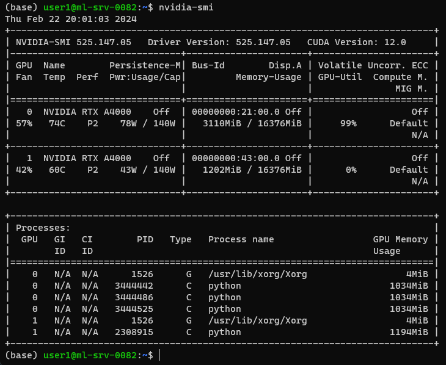

# 2024-02-22: Understanding nvidia-smi

  
  
Date: [Your Date]

  
Role: [Your Role]

## Introduction

In the realm of high-performance computing, Graphics Processing Units (GPUs) play a pivotal role in accelerating complex computations. Whether it's deep learning, scientific simulations, or graphics rendering, GPUs offer immense parallel processing power that significantly speeds up tasks compared to traditional Central Processing Units (CPUs). However, harnessing this power efficiently requires monitoring and understanding GPU performance, which is where tools like NVIDIA-SMI come into play.

## What is NVIDIA-SMI?

NVIDIA System Management Interface (SMI) is a command-line tool provided by NVIDIA that allows users to monitor and manage various aspects of NVIDIA GPU devices. It provides real-time information about GPU utilization, memory usage, temperature, power consumption, and processes running on the GPU.

## Understanding the Output:

The output of NVIDIA-SMI can be dense and cryptic at first glance, but breaking it down reveals valuable insights into GPU performance:

1. **GPU Information**:
   - Identifies the GPU model, persistence mode, temperature, performance state, and power usage.

2. **Memory Usage**:
   - Displays the total memory available on the GPU and how much of it is currently being used.

3. **GPU Utilization**:
   - Indicates the percentage of the GPU's processing power being utilized. Higher utilization suggests heavier computational workload.

4. **Processes**:
   - Lists the processes currently running on the GPU along with their memory usage. This helps identify which applications are utilizing GPU resources.

## Use Cases and Benefits:

1. **Performance Optimization**:
   - By monitoring GPU utilization and memory usage, developers can identify performance bottlenecks and optimize their applications for better efficiency.

2. **Resource Management**:
   - System administrators can use NVIDIA-SMI to ensure equitable distribution of GPU resources among different users or applications running on a shared GPU cluster.

3. **Troubleshooting**:
   - When encountering issues with GPU-accelerated applications, NVIDIA-SMI can provide valuable diagnostic information such as overheating, excessive memory usage, or conflicting processes.

4. **Capacity Planning**:
   - By analyzing historical data collected by NVIDIA-SMI, organizations can make informed decisions about upgrading hardware or scaling their GPU infrastructure to meet future computational demands.

## Output of the `nvidia-smi`

This output is from the NVIDIA System Management Interface (SMI) command, which provides information about the NVIDIA GPUs in a system. Let's dissect the details:

1. **GPU Information**:
   - Two GPUs are listed, both NVIDIA RTX A4000.
   - GPU 0 is identified with Bus-Id `00000000:21:00.0`, and GPU 1 with Bus-Id `00000000:43:00.0`.
   - Both GPUs are currently inactive (`Off` under "Persistence-M").
   - GPU 0 has a fan speed of 57%, temperature of 74°C, and is operating at performance state P2, utilizing 78W out of its 140W power capacity.
   - GPU 1 has a fan speed of 42%, temperature of 60°C, and is also operating at performance state P2, utilizing 43W out of its 140W power capacity.

2. **Memory Usage**:
   - GPU 0:
     - Currently using 3110MiB out of 16376MiB total memory.
   - GPU 1:
     - Currently using 1202MiB out of 16376MiB total memory.

3. **GPU Utilization**:
   - GPU 0 is heavily utilized (`99%` under "GPU-Util"), indicating significant computational workload.
   - GPU 1 is idle (`0%` under "GPU-Util").

4. **Processes**:
   - GPU 0:
     - Running processes include several Python instances (`python`) with process IDs `3444442`, `3444486`, and `3444525`, utilizing GPU memory.
     - An Xorg process (`/usr/lib/xorg/Xorg`) is also running, using minimal GPU memory.
   - GPU 1:
     - A Python process (`python`) with process ID `2308915` is running, utilizing GPU memory.
     - An Xorg process (`/usr/lib/xorg/Xorg`) is also running, using minimal GPU memory.

In summary, the output indicates that GPU 0 is under heavy load, likely due to Python processes, while GPU 1 is largely idle. This information is crucial for monitoring GPU usage, optimizing performance, and troubleshooting potential issues in systems utilizing NVIDIA GPUs for computational tasks.

## Conclusion:

In the era of parallel computing and AI-driven applications, GPUs have emerged as indispensable tools for accelerating a wide range of computational tasks. NVIDIA-SMI serves as a window into the performance and health of NVIDIA GPUs, empowering users to optimize, manage, and troubleshoot their GPU-accelerated workflows effectively. Understanding and harnessing the insights provided by NVIDIA-SMI can unlock the full potential of GPU computing and drive innovation across various domains.

Whether you're a data scientist training deep learning models, a researcher running simulations, or a system administrator managing GPU clusters, NVIDIA-SMI is a valuable ally in your quest for peak performance and efficiency in GPU computing.

